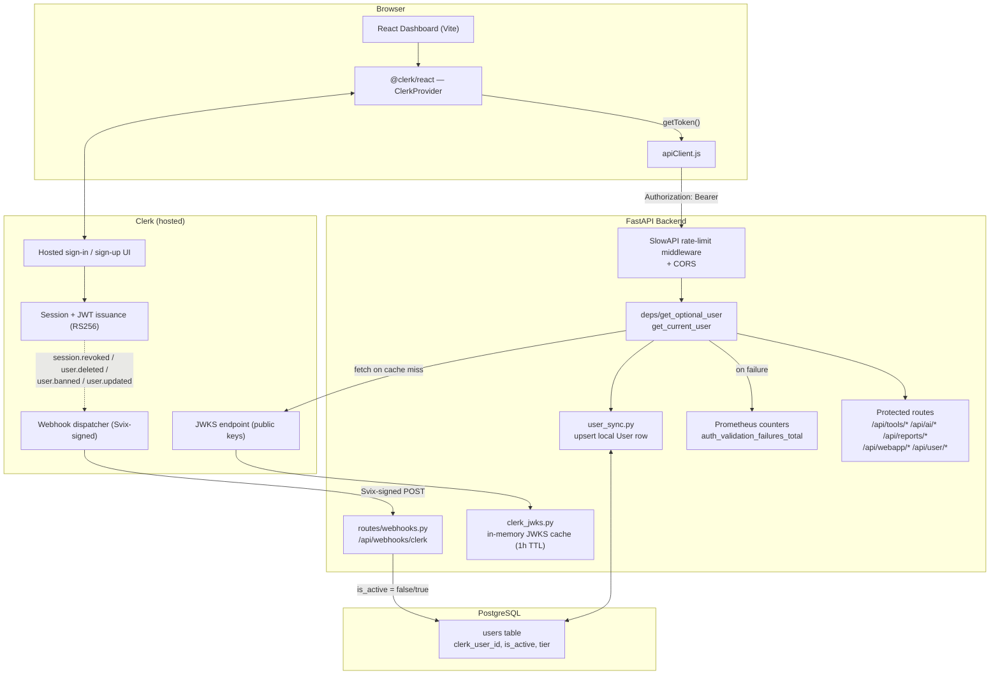
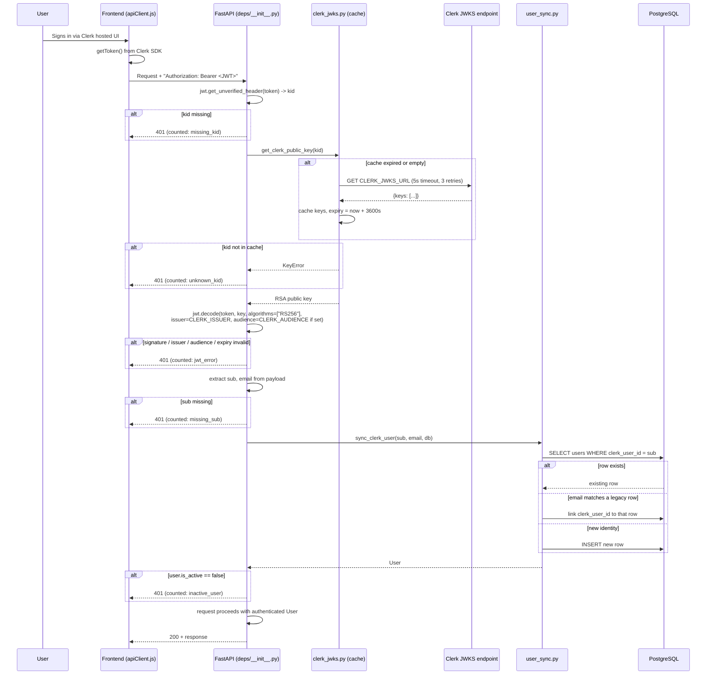
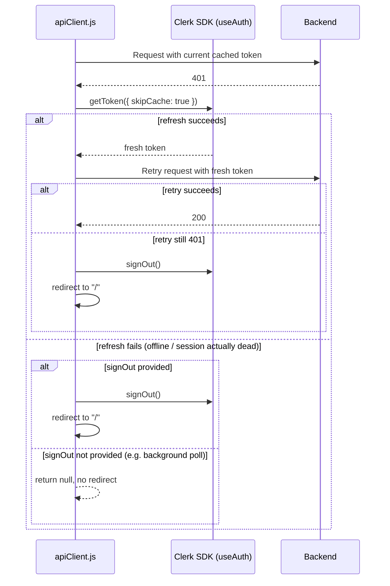
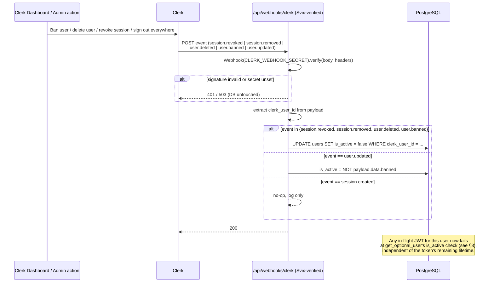

# Authentication

This document describes how authentication works end-to-end in CyberSec
Toolkit: identity provider, token issuance, backend validation, session
revocation, rate limiting, and observability. It reflects the code as of
the auth hardening work (`c1a8fe8` — Clerk webhooks, JWT audience
verification, per-user rate limits — and `462fd31` — legacy password
column removed).

For the full incident history and the original hardening rationale, see
[`docs/history/AUTHENTICATION_AUDIT_REPORT.md`](docs/history/AUTHENTICATION_AUDIT_REPORT.md)
(a 2026-07-04 production outage postmortem) and
[`docs/history/AUTH_HARDENING_CHANGELOG.md`](docs/history/AUTH_HARDENING_CHANGELOG.md).

---

## 1. Summary

- **Identity provider:** [Clerk](https://clerk.com) — hosted sign-in/sign-up UI,
  session management, and token issuance. This app does **not** store
  passwords and has no custom login/register endpoints.
- **Token type:** RS256-signed JWT, issued by Clerk, validated locally
  against Clerk's public JWKS keys — no network round-trip to Clerk on
  every request (keys are cached).
- **Revocation:** Clerk webhooks (Svix-signed) push session/account
  lifecycle events to the backend, which immediately deactivates the
  local user row — this is the kill-switch for compromised or
  offboarded accounts, since a JWT is otherwise valid until it expires
  naturally.
- **Rate limiting:** two independent limiters — a per-IP outer bound
  (100/min) on everything, and a per-user inner bound (30/min) on
  scan-heavy endpoints, keyed on the JWT's `sub` claim so a leaked token
  can't be spread across IPs to dodge the limit.
- **Observability:** every auth validation failure increments a labeled
  Prometheus counter (`reason` = missing_kid / unknown_kid / jwt_error /
  missing_sub / inactive_user / sync_error / unexpected_error), with a
  suggested alert rule for probing/forgery bursts.

---

## 2. Architecture



**Why this shape:** Clerk owns everything password/session-related — sign-in,
MFA, session lifecycle, password resets — so this codebase never touches
credentials. The backend's only job is: (1) verify a token is genuinely
from Clerk and unexpired, (2) mirror the Clerk identity into a local
`users` row for foreign keys and app-specific fields (tier, usage
tracking), and (3) react to Clerk telling it a session/account died.

---

## 3. Request flow — authenticating a normal API call



**Failure-mode note:** if the Clerk JWKS endpoint is unreachable and the
local cache has *never* been populated, requests fail closed (401). If a
cache already exists and only the refresh fails, the stale cache is kept
and used — so a brief Clerk outage doesn't lock everyone out, at the cost
of possibly trusting a since-rotated key for a short window.

---

## 4. Token refresh & sign-out flow (frontend)

`apiClient.js` centralizes all outgoing requests and handles 401s
transparently:



This means a naturally-expired token is invisible to the user in the
common case (silent refresh + retry), while a **truly dead** session
(revoked, banned, deleted — see §5) results in an automatic sign-out
rather than a confusing stuck UI. The distinction between "background
poll" (e.g. `TierContext` polling `/api/user/me`) and "user-initiated
action" is deliberate: `signOut` is only passed where a redirect makes
sense, so background polling failures don't yank the user off whatever
page they're on.

The JWT is sent as an `Authorization` header, including on SSE stream
requests (`apiStream`, using `fetch()` rather than `EventSource`) — this
is intentional: `EventSource` can only send the token as a query
parameter, which leaks into server access logs, browser history, and the
`Referer` header. Using `fetch()` keeps the token out of all of those.

---

## 5. Revocation flow — killing a session before natural expiry

A JWT is valid by signature alone until it expires. Without a revocation
path, a compromised token, an offboarded employee, or a banned abuser
keeps working until the token's natural `exp`. Clerk webhooks close this
gap:



**Endpoint is intentionally not JWT-gated.** `/api/webhooks/clerk` does
not go through `get_current_user` — it's authenticated by Svix signature
verification instead, since the caller is Clerk's infrastructure, not a
logged-in user. It's also exempt from the per-IP rate limiter
(`@limiter.exempt`): Clerk's delivery IPs are fixed and can burst (e.g. a
mass sign-out event), and rate-limiting the kill-switch itself would be
counterproductive.

**Setup required (not automatic):** this flow only activates once you
configure it in Clerk's dashboard — see §7.

---

## 6. Rate limiting

Two independent SlowAPI limiters, defined in `cybersec/apps/api/rate_limit.py`:

| Limiter | Key | Limit | Scope | Why |
|---|---|---|---|---|
| `limiter` | Client IP (`get_remote_address`) | 100/minute | Global outer bound, all routes, via `SlowAPIMiddleware` | Baseline abuse protection |
| `user_limiter` | JWT `sub` claim (falls back to IP if no/invalid token) | 30/minute | Scan-heavy endpoints in `tools.py` (`port_scan`, `os-fingerprint`, `subdomain`, etc.), applied as a route decorator | Stops a single leaked/stolen token from being replayed across many IPs to bypass the per-IP limit; also stops one user behind shared NAT from starving other users' budget |

The `sub` claim used for rate-limit keying is extracted with
`jwt.decode(token, options={"verify_signature": False})` — **this is
safe and intentional**: the value is only used as a bucketing key for
counting requests, never as an authentication decision. Actual identity
verification always happens separately in `get_optional_user` (§3).

When the per-user limiter trips, it's logged at `WARNING` with the `sub`
claim — a spike here is a leaked-token/abuse signal worth watching in
monitoring, distinct from normal per-IP rate limiting noise.

---

## 7. Setup checklist (Clerk Dashboard configuration)

Merging the code does **not** activate these — they require dashboard-side
setup:

- [ ] **Publishable/secret keys.** Set `CLERK_PUBLISHABLE_KEY`,
      `CLERK_SECRET_KEY`, `VITE_CLERK_PUBLISHABLE_KEY` in your deployed
      environment (from Clerk Dashboard → API Keys). Use `pk_live_...` /
      `sk_live_...` for production, not `pk_test_...`.
- [ ] **JWKS URL + issuer.** Set `CLERK_JWKS_URL` and `CLERK_ISSUER` to
      match your Clerk instance
      (`https://<your-subdomain>.clerk.accounts.dev/.well-known/jwks.json`
      and `https://<your-subdomain>.clerk.accounts.dev` respectively).
- [ ] **Audience verification (optional but recommended).** Create a
      [JWT template](https://clerk.com/docs/backend-requests/jwt-templates)
      in Clerk's dashboard with a custom `aud` claim (e.g.
      `"cybersec-toolkit-api"`), then set `CLERK_AUDIENCE` to match. If
      `CLERK_AUDIENCE` is left unset, audience verification is skipped
      entirely (backward-compatible default) — a JWT from any app on the
      same Clerk instance would be accepted, scoped only by issuer.
- [ ] **Webhook subscription (required for revocation to work).** In
      Clerk Dashboard → Webhooks, create an endpoint pointed at
      `https://<your-domain>/api/webhooks/clerk` and subscribe to:
      `session.revoked`, `session.removed`, `user.deleted`,
      `user.banned`, `user.updated`. Copy the signing secret into
      `CLERK_WEBHOOK_SECRET`. **Without this step, revocation is inert
      code** — the endpoint exists but never receives events, and
      `is_active` never flips on ban/delete/revoke.
- [ ] **Verify the webhook actually fires.** Clerk's dashboard has a
      "Testing" tab per webhook endpoint that lets you send a sample
      event and see the response code — confirm you get `200`, not
      `401`/`503`.

---

## 8. Configuration reference

All settings load from `cybersec/config/settings.py` (env-driven via
`pydantic-settings`, `.env` file, see `.env.example`):

| Variable | Where used | Required? | Notes |
|---|---|---|---|
| `CLERK_PUBLISHABLE_KEY` | Frontend build (Vite embeds it) | Yes | Safe to expose in the frontend bundle |
| `CLERK_SECRET_KEY` | `user_sync.py` (Clerk Backend API email lookup) | Yes | Server-side only, never expose |
| `CLERK_JWKS_URL` | `clerk_jwks.py` | Yes | Per-Clerk-instance |
| `CLERK_ISSUER` | `deps/__init__.py` (`jwt.decode(issuer=...)`) | Yes | Per-Clerk-instance |
| `CLERK_AUDIENCE` | `deps/__init__.py` | No (opt-in) | Empty string = audience verification skipped |
| `CLERK_WEBHOOK_SECRET` | `routes/webhooks.py` (Svix verification) | Yes, for revocation | Webhook requests are rejected with 503 if unset |
| `VITE_CLERK_PUBLISHABLE_KEY` | Frontend (`main.jsx`) | Yes | Same value as `CLERK_PUBLISHABLE_KEY`, Vite-prefixed |
| `CORS_ORIGINS` | `main.py` (`CORSMiddleware`) | No | Defaults to `localhost:3000,localhost:8080` — **must be set explicitly for production domains** |

---

## 9. Data model

Auth-relevant columns on `users` (`cybersec/database/models.py`):

| Column | Type | Purpose |
|---|---|---|
| `id` | UUID (PK) | Internal identity, used for FKs (scans, tool results) |
| `clerk_user_id` | string, unique, nullable, indexed | Clerk's `sub` claim — the actual authentication identity |
| `email` | string, unique, nullable | Nullable because Clerk users can withhold email exposure |
| `is_active` | bool, default `true` | **The revocation kill-switch** — flipped by the webhook handler (§5); checked on every request in `get_optional_user` |
| `is_superuser` | bool, default `false` | Admin flag (application-level authorization, not part of the Clerk auth flow itself) |
| `tier` | enum (`free`/`paid`) | Usage-tier gating, unrelated to authentication but adjacent (see `TierContext` on the frontend) |
| `tool_usage` | JSONB | Per-tool daily usage counters for tier limits |

`hashed_password` was removed in migration
`2026_8_1_0000-remove_hashed_password.py` — password-based auth is no
longer possible even at the schema level, not just at the route level
(the old `/api/auth/register` / `/api/auth/login` routes were already
decommissioned — `routes/auth.py` registers zero routes and both paths
return 404).

---

## 10. Observability

Every auth validation failure in `get_optional_user` increments a
labeled Prometheus counter, scraped via `GET /api/metrics` with a
`cybersec_` prefix:

| `reason` label | Failure point | What it usually means |
|---|---|---|
| `missing_kid` | JWT header has no `kid` | Malformed/forged token |
| `unknown_kid` | `kid` not in cached JWKS | **Probing/forgery signal** — not normal user behavior |
| `jwt_error` | Signature/expiry/issuer/audience check failed | Expired token — the majority of normal failures |
| `missing_sub` | Token valid but no `sub` claim | Malformed custom token |
| `inactive_user` | Local `is_active` is false | Revocation kill-switch fired (expected after a ban/delete) |
| `sync_error` | DB/Clerk API error during user upsert | Infra problem, investigate |
| `unexpected_error` | Anything else | Bug — investigate |

A second counter, `auth_validation_failures_by_ip`, is cardinality-capped
at 1000 distinct IPs; beyond that, new IPs are logged at `WARNING`
instead of creating new metric series.

**Suggested alert** (a burst of `unknown_kid` looks nothing like normal
traffic, which is mostly `jwt_error`/`inactive_user`):

```yaml
- alert: ClerkJwtUnknownKidBurst
  expr: rate(cybersec_auth_validation_failures_total{reason="unknown_kid"}[5m]) > 5
  for: 2m
  labels: { severity: warning }
  annotations:
    summary: "Burst of JWTs with unknown key ids (possible signature forgery probing)"
```

See [`docs/history/AUTH_HARDENING_CHANGELOG.md`](docs/history/AUTH_HARDENING_CHANGELOG.md)
for the full original alerting writeup this was consolidated from.

Test coverage: `tests/apps/api/test_jwt_audience.py`,
`tests/apps/api/test_webhooks.py`, `tests/apps/api/test_user_rate_limit.py`,
`tests/apps/api/test_auth_failure_metrics.py` — 36 tests covering every
path described in this document.

---

## 11. Known gaps

Honest list of what this system does **not** yet do, so it isn't
mistaken for complete:

- **No CI test gate.** `.github/workflows/main_cybersec.yml` builds and
  deploys to Azure on every push to `main` without running `pytest` — a
  broken auth change could ship without the test suite (§10) ever running
  against it.
- **`CLERK_AUDIENCE` is opt-in and defaults to unverified.** Until a JWT
  template with a custom `aud` claim is configured in Clerk (§7), a valid
  RS256 token from any app sharing the same Clerk instance would pass
  validation here, scoped only by issuer.
- **Webhook revocation depends entirely on the dashboard subscription
  existing** (§7) — the code path is fully tested, but nothing in this
  repo can verify the Clerk dashboard is actually configured correctly in
  a given deployment. Use the Clerk dashboard's webhook "Testing" tab to
  confirm after every deploy to a new environment.
- **No token blacklist for the window between a compromise and the
  webhook event.** Revocation is event-driven (Clerk pushes a webhook),
  not poll-based — there's no gap once the event fires, but if Clerk's
  webhook delivery itself is delayed or fails all retries, the token
  stays valid until Clerk's own retry/backoff eventually succeeds or the
  token naturally expires.
- **`is_superuser` exists on the model but there's no documented
  authorization layer** using it yet in the routes reviewed — it's a
  flag without enforced consumers as of this writing; don't assume
  admin-gated endpoints exist just because the column does.
